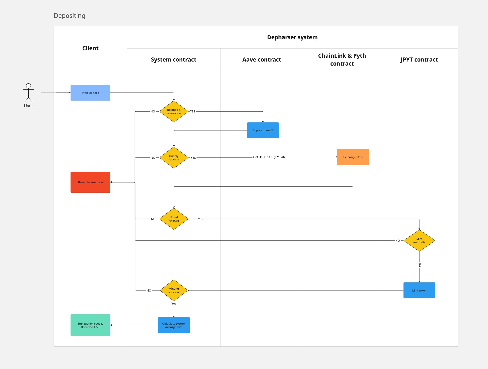
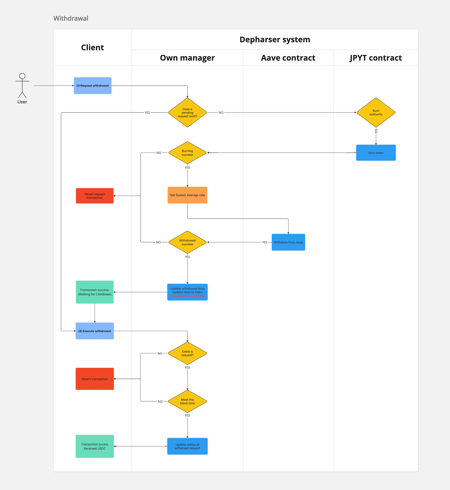

# Dephaser

Dephaser is a decentralized finance (DeFi) protocol that allows users to deposit USDC and mint a JPY-pegged stablecoin. It leverages Aave for yield generation and Chainlink, Pyth oracles for price feeds.

## Key Features

1. **USDC Deposits**: Users can deposit USDC into the protocol.
2. **JPY Minting**: Upon deposit, users receive a JPY-pegged stablecoin.
3. **Yield Generation**: Deposited USDC is supplied to Aave to generate yield.
4. **Withdrawals**: Users can request withdrawals of their USDC by burning the JPY-pegged tokens.
5. **Price Oracles**: Utilizes Chainlink price feeds for accurate USDC/USD and Pyth price feeds for accurate USD/JPY conversion rates.
6. **Cooldown Period**: Implements a cooldown period between withdrawal requests and executions for security.
7. **Protocol Fees**: Ability to set and collect protocol fees on deposits.
8. **Yield Distribution**: Plans for distributing Aave-generated profits back to users.

## Smart Contracts

- **DepositManager**: The main contract handling deposits, withdrawals, and interactions with Aave and Chainlink, Pyth.
- **JpytToken**: The JPY-pegged stablecoin minted when users deposit USDC.

## How It Works

1. **Deposit**:

   - User deposits USDC.
   - Contract calculates the equivalent JPY amount using Chainlink and Pyth price feeds.
   - JPY-pegged tokens are minted to the user.
   - USDC is supplied to Aave for yield generation.

2. **Withdrawal**:

   - User requests a withdrawal by specifying an amount of JPY-pegged tokens.
   - Contract burns the JPY-pegged tokens.
   - A cooldown period begins.
   - After the cooldown, user can execute the withdrawal to receive USDC.

3. **Yield and Fees**:
   - Yield generated from Aave is retained in the protocol.
   - Optional protocol fees can be applied on deposits.
   - Accumulated yield will be distributed back to users in future implementations.

## Flowcharts

To better illustrate the deposit and withdrawal processes, please refer to the following flowcharts:

_Figure 1: Deposit Process Flowchart_

_Figure 2: Withdrawal Process Flowchart_

These flowcharts provide a visual representation of the key steps involved in depositing USDC and withdrawing funds from the Dephaser protocol.

## Yield Distribution

While the current implementation retains yield generated from Aave within the protocol, future updates will introduce mechanisms to distribute this yield back to users.

## Security Features

- Cooldown period for withdrawals
- Role-based access control for administrative functions
- Use of battle-tested protocols (Aave, Chainlink, Pyth)
- Pausable functionality for emergency situations

## Deployment

The protocol is designed to be deployed on Base, leveraging its lower gas fees and faster transaction times.

## Testing

Comprehensive unit tests and fuzz tests are implemented to ensure the robustness and correctness of the protocol under various scenarios.
